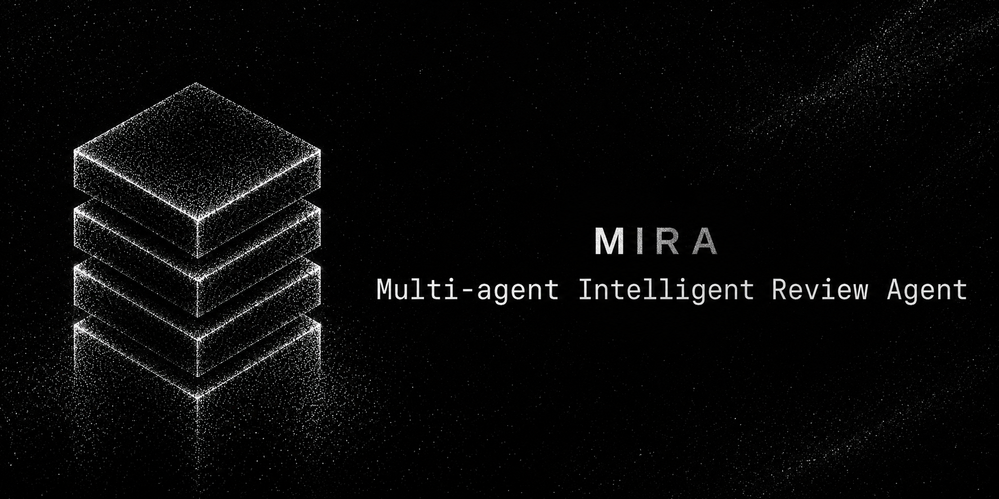
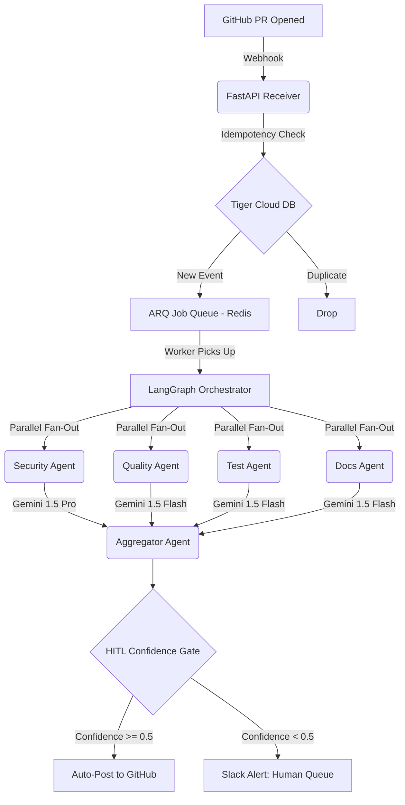

# MIRA — Multi-agent Intelligent Review Agent



[](https://railway.app)
[](https://python.org)
[](https://opensource.org/licenses/MIT)
[](https://async-ar15.github.io/mira/)

**[Read the Full HTML Documentation Site Here](https://async-ar15.github.io/mira/)**

MIRA is a production-grade, open-source AI Pull Request Review Agent built for engineering teams who need more than just a shallow GPT wrapper. 

When a developer opens a PR, a webhook fires. MIRA orchestrates four specialist sub-agents in parallel—**Security, Code Quality, Test Coverage, and Documentation**. Each agent reasons over the diff and retrieves deep codebase context via semantic vector search. An aggregator agent then merges these findings into a single, highly structured review and posts it directly to GitHub. 

Crucially, MIRA acts with caution: if the aggregator's confidence score drops below 0.5, the review is automatically routed to a **Human-In-The-Loop (HITL)** approval queue in Slack instead of posting blindly.

---

## Beyond a Wrapper: Key Features

MIRA was engineered to solve the core issues of standard AI coding assistants: lack of context, hallucination, and lack of accountability.

- **Graph-Based Orchestration:** A LangGraph state machine orchestrates parallel execution of 4 specialized agents, preventing a single prompt from being overwhelmed by multiple concerns.
- **Smart Model Routing:** Feature-flagged routing automatically assigns complex logic (Security) to **Gemini 1.5 Pro** and structural checks (Tests/Docs) to the much faster **Gemini 1.5 Flash**, balancing cost and intelligence.
- **Human-In-The-Loop (HITL):** MIRA knows when it's confused. Low-confidence reviews are queued for a human reviewer. These human verdicts feed back into the system to calibrate future agent scoring.
- **Immutable Audit Trails:** Every finding, cost metric, and HITL decision is stored in Tiger Cloud. Nightly ARQ jobs bundle these events and ship them to an **AWS S3 Bucket with Object Lock** (7-year retention) for strict SOC2 compliance.
- **Role-Based Security:** Dashboard and API access is secured via JWT authentication with `admin`, `reviewer`, and `viewer` roles.

---

## System Architecture



MIRA follows a modular monolith design. A single FastAPI service handles ingress, delegating the heavy AI orchestration to Redis-backed ARQ workers to prevent webhook timeouts. 

See our `docs/adr/ADR-002-architecture-style.md` for our reasoning on modular monoliths vs microservices.

---

## Data Layer — Tiger Cloud (TimescaleDB)

Most AI projects juggle three separate stores: a vector DB for RAG, a time-series store for traces, and Postgres for structured data. MIRA uses [Tiger Cloud](https://tigerdata.com) — a managed TimescaleDB instance — to collapse all three into one single Postgres database. 

One connection pool. One backup policy. One place to reason about the data.

### Three roles, one database

| Layer | Tiger Feature | What it does |
|---|---|---|
| **Semantic memory** | pgvectorscale DiskANN | Stores chunked code, ADRs, and prior reviews. 4 specialist agents query it for context on every PR. Replaces Qdrant entirely. |
| **Agent events** | Hypertables | Every span, LLM call, tool call, and decision lands in one time-ordered table: `agent_events`. Powers the trace viewer, audit trail, and cost ledger. |
| **Live dashboards** | Continuous aggregates | Real-time rollups for cost per PR, p95 latency per agent, rejection rate. Materialized so the dashboard stays fast as history grows. |
| **Cost control** | Hypertables + aggregates | Token cost attribution per agent span. Budget caps read from the same aggregate the dashboard does. |

---

## Tech Stack

| Layer | Technology |
|---|---|
| **Backend API** | FastAPI (Python 3.11) |
| **Orchestration** | LangGraph (parallel fan-out, checkpointing) |
| **Job Queue** | Redis + ARQ |
| **Memory / DB** | Tiger Cloud (pgvectorscale DiskANN + hypertables) |
| **LLM Inference** | Google Gemini 1.5 Pro & 1.5 Flash |
| **Sandbox** | Docker (isolated code execution) |
| **Frontend** | Next.js (review dashboard, HITL queue, trace viewer) |
| **Authentication** | python-jose (JWT) |
| **Compliance** | AWS S3 Object Lock (Immutable Audit Exports) |
| **Deploy** | Railway |

---

## Local Development

Get MIRA running locally in less than 5 minutes. The provided Docker Compose stack will spin up the FastAPI server, Redis, the ARQ worker, and a local MinIO instance (to simulate S3 for audit log exports).

```bash
# 1. Clone the repository
git clone https://github.com/async-ar15/mira.git
cd mira

# 2. Configure environment variables
# (Requires a GitHub Fine-Grained Token, Gemini API Key, and Tiger Cloud URL)
cp .env.example .env

# 3. Boot the local stack
docker compose -f docker-compose.dev.yml up -d
```

The API will be available at `http://localhost:8000`. 
Verify health: `GET http://localhost:8000/health`

---

## 20-Phase Build Roadmap

MIRA was built systematically across 20 phases to ensure absolute reliability and engineering rigor.

| # | Phase | Tiger Integration |
|---|---|---|
| 0 | Cognitive Design — autonomy level, HITL boundaries | |
| 1 | System Architecture — module graph, ADRs | |
| 2 | Frontend Engineering — dashboard shell, streaming | |
| 3 | Backend and API Layer — FastAPI, webhook, idempotency | |
| 4 | Workflow Orchestration — LangGraph, parallel fan-out | |
| 5 | LLM and Reasoning Layer — model routing, prompt registry | |
| 6 | Memory Architecture — RAG on pgvectorscale, hybrid retrieval | **Tiger** |
| 7 | Tooling and Sandboxing — tool registry, Docker sandbox | |
| 8 | Multi-Agent Systems — 4 specialists, contracts, aggregator | |
| 9 | Evaluation Systems — golden dataset, LLM-as-judge | |
| 10 | Observability and Tracing — OTel spans in agent_events hypertable | **Tiger** |
| 11 | Security Architecture — threat model, RBAC, audit trail | |
| 12 | Reliability Engineering — retries, circuit breakers, idempotency | |
| 13 | Infrastructure — Tiger Cloud provisioning, Tiger MCP wiring | **Tiger** |
| 14 | Data Engineering — ingestion pipeline, hypertable schema design | **Tiger** |
| 15 | Governance and Compliance — audit logs, explainability | |
| 16 | Economics and Cost Control — per-agent cost via continuous aggregates | **Tiger** |
| 17 | Developer Experience — prompt playground, trace viewer | |
| 18 | CI/CD for AI — prompt versioning, eval gates, canary releases | |
| 19 | Human in the Loop — approval queue, escalation, feedback | |
| 20 | Continuous Learning — drift detection from continuous aggregates | **Tiger** |

---

## Project Structure

```
backend/
  api/              REST endpoints (webhook, reviews, economics, HITL, export)
  auth/             JWT role-based gating (viewer, reviewer, admin)
  agents/           4 specialist agents (security, quality, tests, docs)
  config/           Settings, environment, feature flags
  data/             Ingestion pipeline, embedding, freshness
  database/         Postgres async engine + Tiger pool
  economics/        Cost repository, budget caps
  job_queue/        ARQ worker, job definitions
  memory/           TigerMemoryClient (pgvectorscale + hybrid search)
  observability/    Events spine, OTel traces
  orchestrator/     LangGraph graph, nodes, engine
  reliability/      Circuit breakers, retries
  tools/            Tool registry, Docker sandbox

docs-site/          Source code for the GitHub Pages static documentation site
docs/
  adr/              Architecture Decision Records (ADR-001 to ADR-005)

scripts/
  migrations/       2026-06-tiger-init.sql — idempotent schema DDL

tests/              Phase-by-phase test suite
frontend/           Next.js dashboard
```

---

Built by [Aman Rajput](https://github.com/async-ar15)
